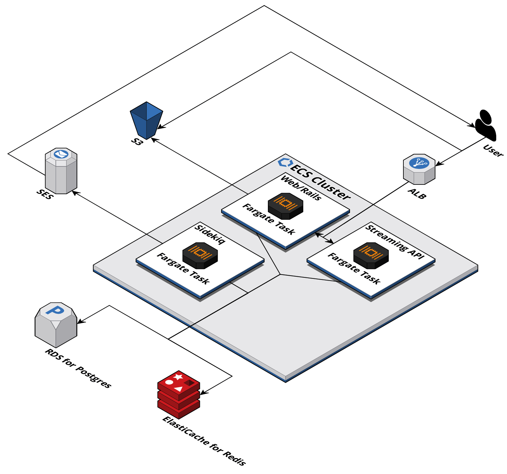

# Mastodon on AWS

Want to host your own Mastodon instance on AWS? Here you go.

The architecture consists of the following building blocks.

* Application Load Balancer (ALB)
* ECS and Fargate
* RDS Aurora Serverless
* ElastiCache (Redis)
* S3
* SES
* CloudWatch
* IAM
* KMS
* Route 53



Check out our blog post [Mastodon on AWS: Host your own instance](https://cloudonaut.io/mastodon-on-aws/) for more details.

## Prerequisites

First, you need an AWS account.

Second, a top-level or sub domain where you are able to configure a `NS` record to delegate to the Route 53 nameservers is required. For example, you could register a domain with Rout 53 or use an existing domain and add an `NS` record to the hosted zone.

Third, we recommend to install [Docker Desktop](https://www.docker.com/get-started/) on your local machine to generate the required secrets.

## Installation

### Deploy the infrastructure

[Click here to deploy Mastodon on AWS](https://console.aws.amazon.com/cloudformation/home?#/stacks/create/review?templateURL=https://s3.eu-central-1.amazonaws.com/mastodon-on-aws-cloudformation/v0.9.0/quickstart.yml&stackName=mastodon-on-aws) to your AWS account.

To generate the required secrets and keys use the following commands.

```
# Start Docker container locally
$ docker run -it tootsuite/mastodon:latest sh

# Generate SECRET_KEY_BASE
$ bundle exec rake secret
758a3b431265776b9ab55910890162bb84aec0617724ca611475c3a774965f2d0aca183091d3c1a84ff3640cf7cc438c559034a2735253ee895b7a2308ac450c

# Generate OTP_SECRET
$ bundle exec rake secret
c528b5cbb0236e4b0c2fe38a6d7ed1edc5fa12608c67a45690e225f005bad8bfbabfa99f7b83cb9c0981ba8fcc5fd76c68918d9bc854bd158c2c23fd6df89abc

# Generate VAPID_PRIVATE_KEY and VAPID_PUBLIC_KEY
$ bundle exec rake mastodon:webpush:generate_vapid_key
VAPID_PRIVATE_KEY=am3vlPBGQGv7Rl3xOKXSv7lRYyWfZITItb88FXX9IOs=
VAPID_PUBLIC_KEY=BMGkIr1PaK4v7Kut7q7eoHtWxu9gEBQ5BeV28xOIR9c9VIvDWvOViTn1SV5G2LIEFGWo0f1dQka-UynR58WMn2Y=
```

### Configure the domain name

By creating the CloudFormation stack, you also created a Route 53 hosted zone for the `DomainName` you specified as a parameter.

1. Open [Route 53](https://console.aws.amazon.com/route53/v2/home#Dashboard) via the AWS Management Console.
1. Select `Hosted zones` from the sub navigation.
1. Search and open the hosted zone with the domain name of your Mastodon instance (`DomainName` parameter).
1. Search for the `NS` record and copy the name servers (e.g., `ns-52.awsdns-06.com.`, `ns-659.awsdns-18.net.`, `ns-1698.awsdns-20.co.uk.`, and `ns-1034.awsdns-01.org.`).

In case, you are using a top-level domain like `cloudonaut.io` as the `DomainName` for your Mastodon instance, you need to modify the name servers for your domain. See [Adding or changing name servers and glue records for a domain
](https://docs.aws.amazon.com/Route53/latest/DeveloperGuide/domain-name-servers-glue-records.html) in case you are using Route 53 to register domains.

In case, you are using a sub-domain like `social.cloudonaut.io` as the `DomainName` for your Mastodon instance, you need add an `NS` record to the parent zone. In our example, we added the `NS` record `social.cloudonaut` pointing to `ns-52.awsdns-06.com.`, `ns-659.awsdns-18.net.`, `ns-1698.awsdns-20.co.uk.`, and `ns-1034.awsdns-01.org.` to the hosted zone managing `cloudonaut.io`.

### Enable the admin user / Accessing tootctl

Use the following instructions to access the Mastodon CLI:

1. Open Elastic Container Service (ECS) via the AWS Management Console.
1. Select the ECS cluster with the name prefixed with the name of your CloudFormation stack (e.g., `mastodon-on-aws-*`).
1. Note down the full name of the cluster (e.g., `mastodon-on-aws-Cluster-1NHBMI9NL62QP-Cluster-pkxgiUVXxLC7`).
1. Select the `Tasks` tab.
1. Search for a task with status `Running` and a task definition containing `*-WebService-*` in its name.
1. Note down the task ID (e.g., `a752b99a4cf843ce8a957c374fc98abf`).
1. Install the [AWS CLI](https://docs.aws.amazon.com/cli/latest/userguide/getting-started-install.html).

Use the following command to connect with the container running the Ruby on Rails (Web) application. Replace <CLUSTER_NAME> with the name of your ECS cluster and <TASK_ID> with the ID of a running ECS task.

```
aws ecs execute-command --cluster <CLUSTER_NAME> --container app --command /bin/bash --interactive --task <TASK_ID>
```

After the session got established you are ready to use the [tootctl](https://docs.joinmastodon.org/admin/tootctl/).

After signing up, you will need to use the command line to give your newly created account admin privileges. Replace `<USERNAME>` with your user name (e.g., `andreas`).

```
RAILS_ENV=production bin/tootctl accounts modify <USERNAME> --role Owner
```

### Activating SES

In case you haven't used SES in your AWS account before, you most likely need to request production access for SES. This is required so that your Mastodon instance is able to send emails (e.g., registration, forgot password, and many more). See [Moving out of the Amazon SES sandbox](https://docs.aws.amazon.com/ses/latest/dg/request-production-access.html) to learn more.

## Costs for running Mastodon on AWS

Estimating costs for AWS is not trivial. My estimation assumes a small Mastodon instance for 1-50 users. The architecture's monthly charges are about $65 per month. The following table lists the details (us-east-1).

| Service | Configuration | Monthly Costs (USD) |
| ---------- | ------------- | ----------------------------: |
| ECS + Fargate | 3 Spot Tasks | $12.08 |
| RDS for Postgres | t4g.micro | $12.10 |
| ElastiCache for Redis | t4g.micro | $11.52 |
| ALB | Load Balancer Hours | $16.20 |
| S3 | 25 GB + requests | $0.58 |
| Route 53 | Hosted Zone | $0.50 |
| **Total** | | $52.97 |

Please note that the cost estimation is not complete and costs differ per region. For example, the estimation does not include network traffic, CloudWatch, SES, and domain. [Monitor your costs](https://docs.aws.amazon.com/cost-management/latest/userguide/budgets-create.html)!

## Update

Here is how you update your infrastructure.

1. Open CloudFormation via the AWS Management Console.
1. Select the CloudFormation stack which is named `mastodon-on-aws` in case you created the stack with our defaults.
1. Press the `Edit` button.
1. Choose the option `Replace current template` with `https://s3.eu-central-1.amazonaws.com/mastodon-on-aws-cloudformation/v0.9.0/quickstart.yml`.
1. Go through the rest of the wizard and keep the defaults.

## Development

IaC based on [cfn-modules](https://github.com/cfn-modules/docs).

```
$ npm install
$ aws cloudformation package --template-file mastodon.yaml --s3-bucket <S3_BUCKET> --output-template-file packaged.yml
$ aws cloudformation deploy --template-file packaged.yml --stack-name mastodon-on-aws --capabilities CAPABILITY_IAM --parameter-overrides "DomainName=<DOMAIN_NAME>" "SecretKeyBase=<SECRET_KEY_BASE>" "OtpSecret=<OTP_SECRET>" "VapidPrivateKey=<VAPID_PRIVATE_KEY>" "VapidPublicKey=<VAPID_PUBLIC_KEY>"
```
